<h1 align="center">My SOLUTION to <br/>
CS231N: Convolutional Neural Networks for Visual Recognition <br/>
(Spring 2025 Version)</h1>


This is my solution to the Stanford CS231N course (Spring 2025 version). The original assignment can be found [here](https://cs231n.stanford.edu/). This course has updated the newest video lectures in the Youtube [here](https://www.youtube.com/playlist?list=PLoROMvodv4rOmsNzYBMe0gJY2XS8AQg16).  
This is course is more focused on the fundamentals of deep learning and computer vision. The assignments are implemented in Python and use NumPy for different components in the deep learning models. Mastering these fundamentals will help you to understand the more advanced models and architectures in deep learning. There are 3 assignments in total:

- Assignment 1: Basic Operations and Image Classification
- Assignment 2: Convolutional Neural Networks and PyTorch
- Assignment 3: Transformers, CLIP, DINO, and Diffusion Models

**Table of Contents**
- [Assignment 01](#assignment-01)
	- [Q1: K-Nearest Neighbor classifier](#q1-k-nearest-neighbor-classifier)
		- [K-NN Algorithm](#k-nn-algorithm)
		- [Calculate Distance](#calculate-distance)
		- [Compares](#compares)
		- [Experiement \& Cross Validation](#experiement--cross-validation)
	- [Q2: Implement a Softmax classifier](#q2-implement-a-softmax-classifier)
		- [Setup](#setup)
	- [Q3: Two-Layer Neural Network](#q3-two-layer-neural-network)
		- [Affine Layer](#affine-layer)
		- [ReLU](#relu)
		- [Experiement](#experiement)
		- [Cross Validation](#cross-validation)
	- [Q4: Higher Level Representations: Image Features](#q4-higher-level-representations-image-features)
	- [Q5: Training a fully connected network](#q5-training-a-fully-connected-network)
		- [SGD vs. SGD Momentum](#sgd-vs-sgd-momentum)
		- [RMSProp and Adam](#rmsprop-and-adam)
		- [Best Model](#best-model)
- [Assignment 02](#assignment-02)
	- [Q1: Batch Normalization](#q1-batch-normalization)
		- [Batch Normalization](#batch-normalization)
		- [Batch Normalization for Deep Networks](#batch-normalization-for-deep-networks)
		- [Layer Normalization](#layer-normalization)
	- [Q2: Dropout](#q2-dropout)
	- [Q3: Convolutional Neural Networks](#q3-convolutional-neural-networks)
	- [Q4: PyTorch on CIFAR-10](#q4-pytorch-on-cifar-10)
	- [Q5: Image Captioning with Vanilla RNNs](#q5-image-captioning-with-vanilla-rnns)
- [Assignment 03](#assignment-03)
	- [Q1: Image Captioning with Transformers](#q1-image-captioning-with-transformers)
		- [Vision Transformer](#vision-transformer)
	- [Q2: Self-Supervised Learning for Image Classification](#q2-self-supervised-learning-for-image-classification)
	- [Q3: Denoising Diffusion Probabilistic Models](#q3-denoising-diffusion-probabilistic-models)
	- [Q4: CLIP and DINO](#q4-clip-and-dino)
		- [CLIP](#clip)
		- [DINO](#dino)


# Assignment 01

Change the folder name

```Python
FOLDERNAME = "Colab Notebooks/Stanford CS231N/assignment1/"
```

Install the dependent

```Python
!python -m pip install -U ipython ipykernel
```

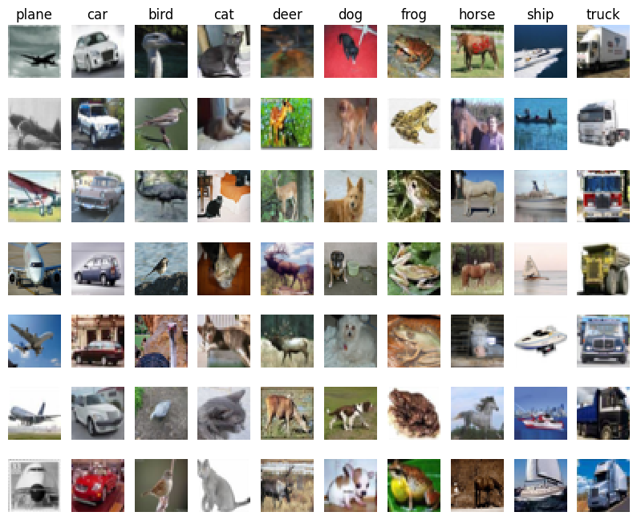

## Q1: K-Nearest Neighbor classifier


### K-NN Algorithm
Assume we already have distance to each datapoint in the training set. The K-NN algorithm do the following, given `K` as arguments
1. sort training data points according to the distance 
2. get the most close `K` points 
3. count the most frequents class in those `K` points 
4. return the result

```Python
dist_to_x_test_i = dists[i]
# 1
sort_index = np.argsort(dist_to_x_test_i)
# 2
top_k_index = sort_index[:k]
closest_y = self.y_train[top_k_index]
# 3 / 4 
y_pred[i] = np.argmax(np.bincount(closest_y))
```


### Calculate Distance 

**L2 Distance** (Euclidean distance) is defined as:

$$
d_2(\mathbf{x}, \mathbf{y}) = \|\mathbf{x} - \mathbf{y}\|_{2}
= \sqrt{\sum_{i=1}^n |x_i - y_i|^2}
$$
```Python
dists[i, j] = np.sqrt(np.sum(np.power(x1 - x2, 2)))
```

while **L1 Distance** (Manhattan Distance) is defined as:

$$
d_1(\mathbf{x}, \mathbf{y}) = \|\mathbf{x} - \mathbf{y}\|_{1}
= \sum_{i=1}^n |x_i - y_i|
$$

Generally the **LP-Norm Distance** is 

$$
d_p(\mathbf{x}, \mathbf{y}) 
= \|\mathbf{x} - \mathbf{y}\|_{p}
= \left( \sum_{i=1}^n |x_i - y_i|^p \right)^{\tfrac{1}{p}}
$$
So the $L_{\infty}$ Norm is 
$$
d_\infty(\mathbf{x}, \mathbf{y}) = \max_{1 \leq i \leq n} |x_i - y_i|
$$

The result
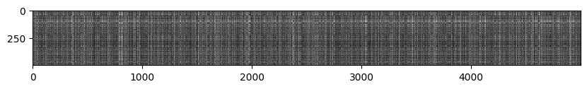


Vector 

$$
d(\mathbf{x}_i, \mathbf{x}_j^{\text{train}})^2 = \|\mathbf{x}_i\|^2 + \|\mathbf{x}_j^{\text{train}}\|^2 - 2 \mathbf{x}_i \cdot \mathbf{x}_j^{\text{train}}
$$

```Python
dists = np.sqrt(
	-2 * (X @ self.X_train.T)
	+ np.power(X, 2).sum(axis=1, keepdims=True)
	+ np.power(self.X_train, 2).sum(axis=1, keepdims=True).T
) 
```


### Compares

```Shell
Two loop version took 280.040472 seconds
One loop version took 52.285528 seconds
No loop version took 1.028926 seconds
```

### Experiement & Cross Validation
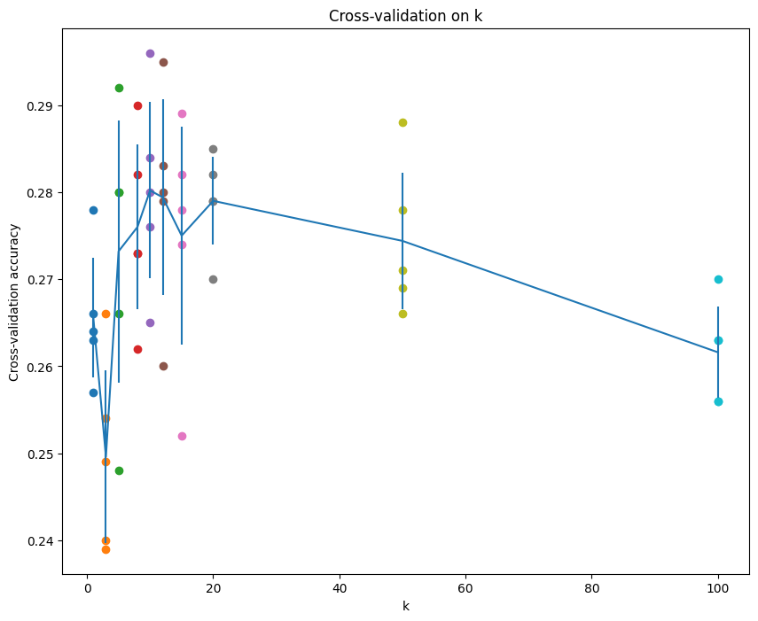


## Q2: Implement a Softmax classifier

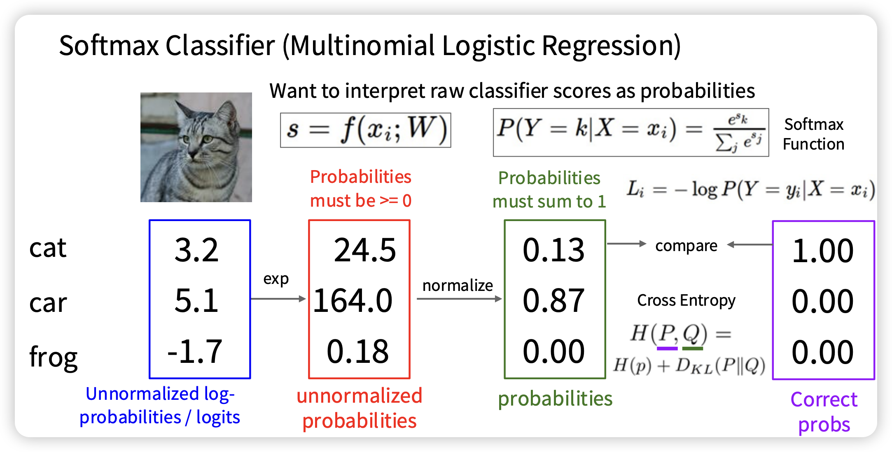
### Setup  
We have: data point $\mathbf{x}_i \in \mathbb{R}^{1 \times D}$, weights $W \in \mathbb{R}^{D \times C}$, logits  $\mathbf{s}_i = \mathbf{x}_i W \in \mathbb{R}^{1 \times C}$

- Predicted probabilities (softmax):  
  
$$
\hat{p}_{i,j} = \frac{e^{s_{i,j}}}{\sum_{k=1}^C e^{s_{i,k}}}, \quad j=1,\dots,C
$$
- One-hot label:  

$$
y_i \in \mathbb{R}^{1 \times C}, \quad y_{i,k} = 1 \text{ for the true class } k
$$

The **cross entropy loss** $\mathcal{L}$ is defined as 

$$
\mathcal{L}_i = -\sum_{j=1}^C y_{i,j} \log \hat{p}_{i,j}
= -\log \hat{p}_{i,k}
$$

To calculate the gradient of $W$ w.r.t. $\mathrm{x}_{i}$, we can implement the **chain rule**

$$
\frac{\partial \mathcal{L}_i}{\partial W}
= \frac{\partial \mathcal{L}_i}{\partial \hat{p}_i} \cdot
\frac{\partial \hat{p}_i}{\partial \mathbf{s}_i} \cdot
\frac{\partial \mathbf{s}_i}{\partial W}
$$

For each components:

$$
\frac{\partial \mathcal{L}_i}{\partial \hat{p}_{i,j}} = -\frac{y_{i,j}}{\hat{p}_{i,j}}
$$

Softmax Jacobian:  

$$
\frac{\partial \hat{p}_{i,m}}{\partial s_{i,j}} 
= \hat{p}_{i,m}\big(\delta_{m,j} - \hat{p}_{i,j}\big)
,
\quad 
\text{where }
\delta_{m,j} = 
\begin{cases}
1 & m=j \\
0 & m\neq j
\end{cases}
$$

So the gradient w.r.t. logits($s_{i}$) is simply:  

$$
\frac{\partial \mathcal{L}_i}{\partial s_{i,j}}
= \sum_{m=1}^C \frac{\partial \mathcal{L}_i}{\partial \hat{p}_{i,m}} 
\frac{\partial \hat{p}_{i,m}}{\partial s_{i,j}}
= \hat{p}_{i,j} - y_{i,j}
\implies \nabla_{s_i}\mathcal{L}_i = \hat{p}_i - y_i
$$

For the linear function: 

$$
\frac{\partial s_{i,j}}{\partial W_{d,j}} = x_{i,d}
$$

Put all together, we have:  

$$
\nabla_W \mathcal{L}_i = \mathbf{x}_i^\top (\hat{p}_i - y_i)
$$

In sum: 
- For a single data point $\mathbf{x}_i$, the **outer product** between $\mathrm{x}_{i}$ and $(\hat{p}_i - y_i)$

$$
\nabla_W \mathcal{L}_i = \mathbf{x}_i^\top \, (\hat{p}_i - y_i)
$$

- For the entire dataset $X \in \mathbb{R}^{N \times D}$:  

$$
\nabla_W \mathcal{L} = X^\top (\hat{P} - Y)
$$

The Loss Curve:
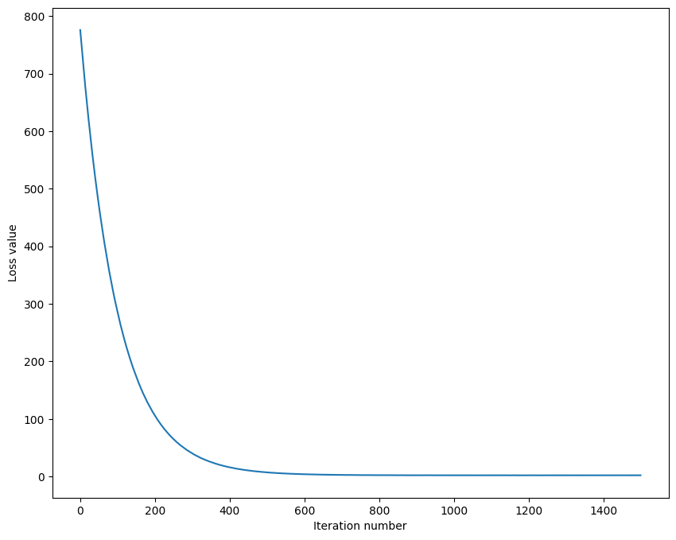


Cross-validation
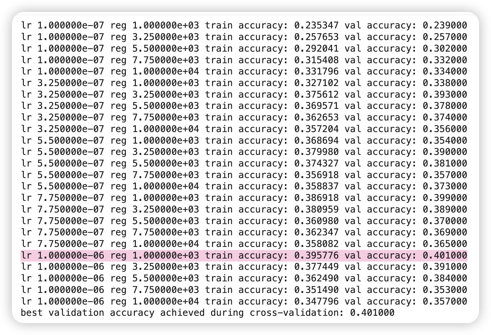
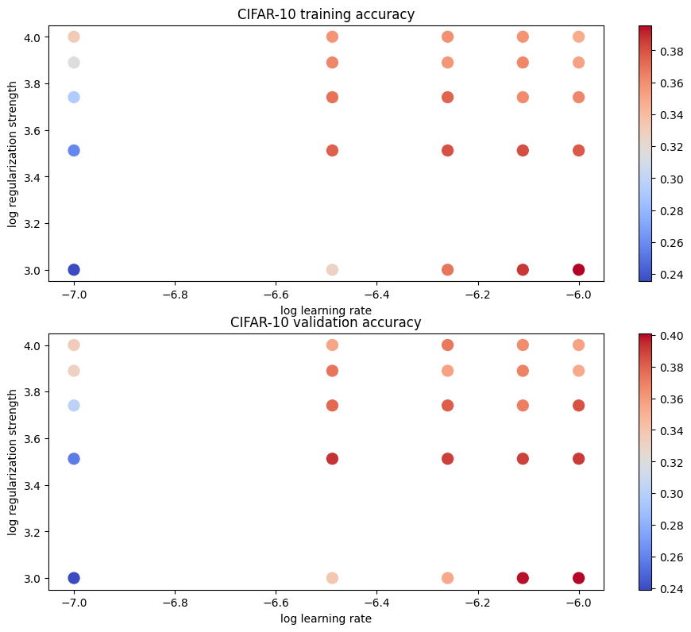


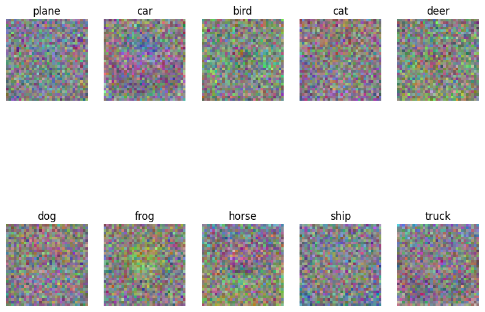


## Q3: Two-Layer Neural Network


### Affine Layer

Forward, according to the assignment, we need to reshape the $x$
$$
\text{out} = xW + b
$$

Backward

$$
\frac{\partial L}{\partial x} = d\text{out} \, W^\top
$$

Remember to reshape the $x$ back to the original shape 

$$
\frac{\partial L}{\partial W} = x^\top \, \text{dout}
$$

$$
\frac{\partial L}{\partial b} = \sum_{i=1}^N \text{dout}_{i,:}
$$

### ReLU


$$
\text{out} = \text{ReLU}(x) = \max(0, x)
$$

$$
dx = \text{dout} \odot \mathbf{1}_{\{x > 0\}}
$$


### Experiement

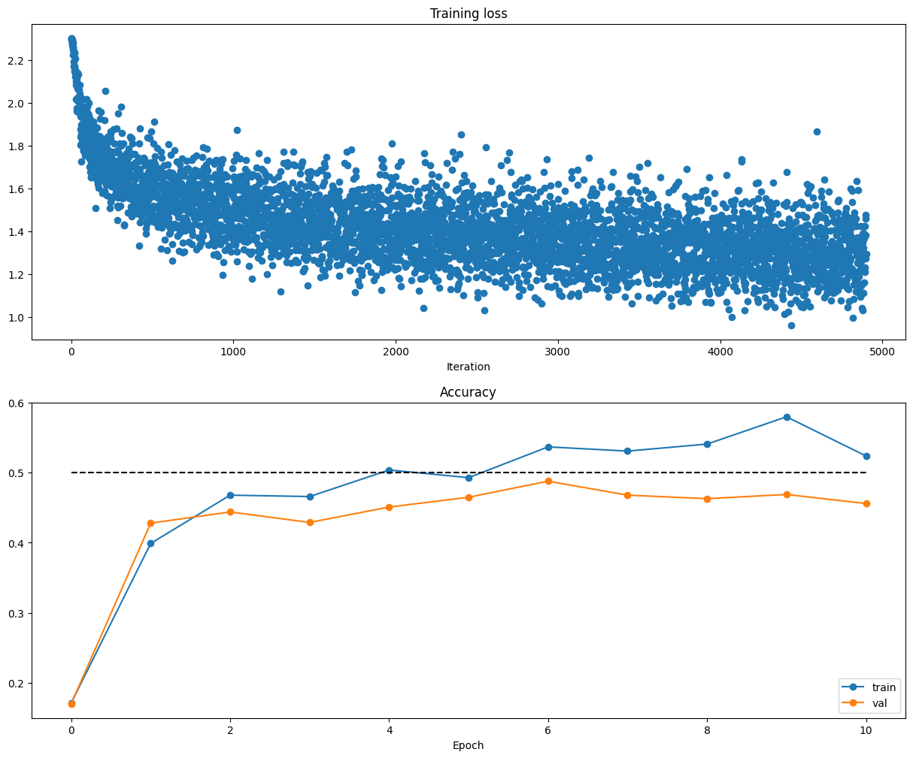

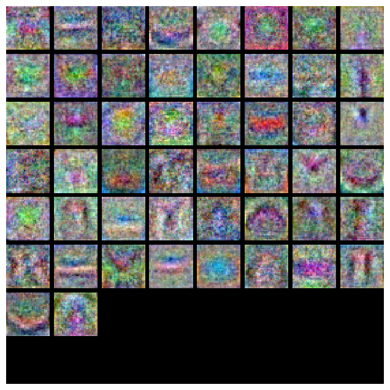


### Cross Validation
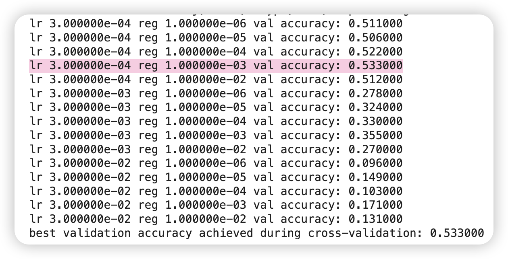


## Q4: Higher Level Representations: Image Features
Just run the code and observe the features. 
For softmax classifier
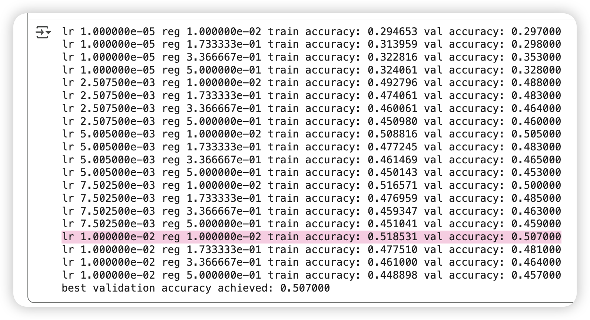


For Two Layer Network
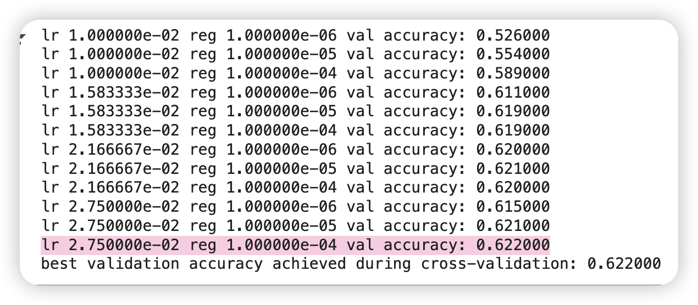


## Q5: Training a fully connected network


Three-layer Net to overfit 50 training examples
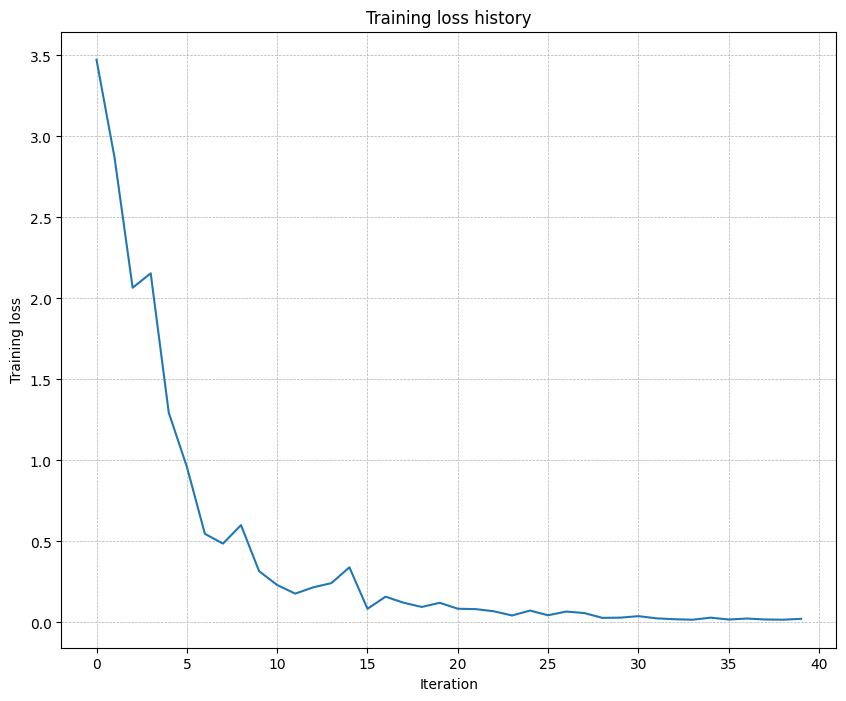


Five-layer Net to overfit 50 training examples

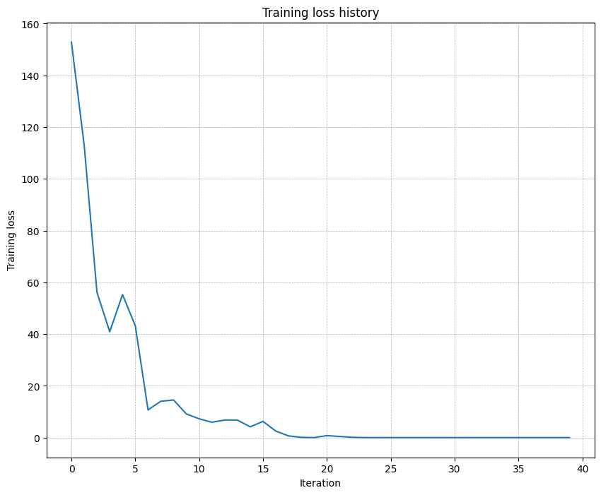


### SGD vs. SGD Momentum
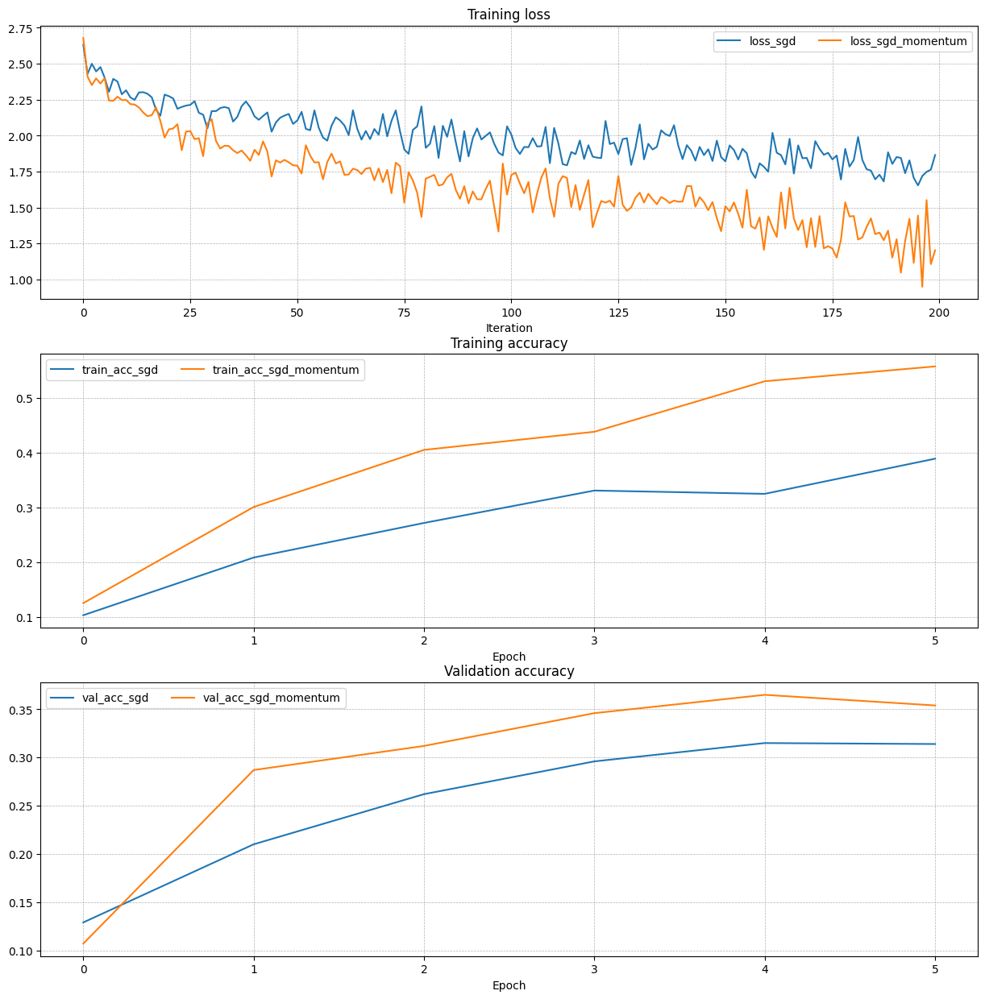


### RMSProp and Adam
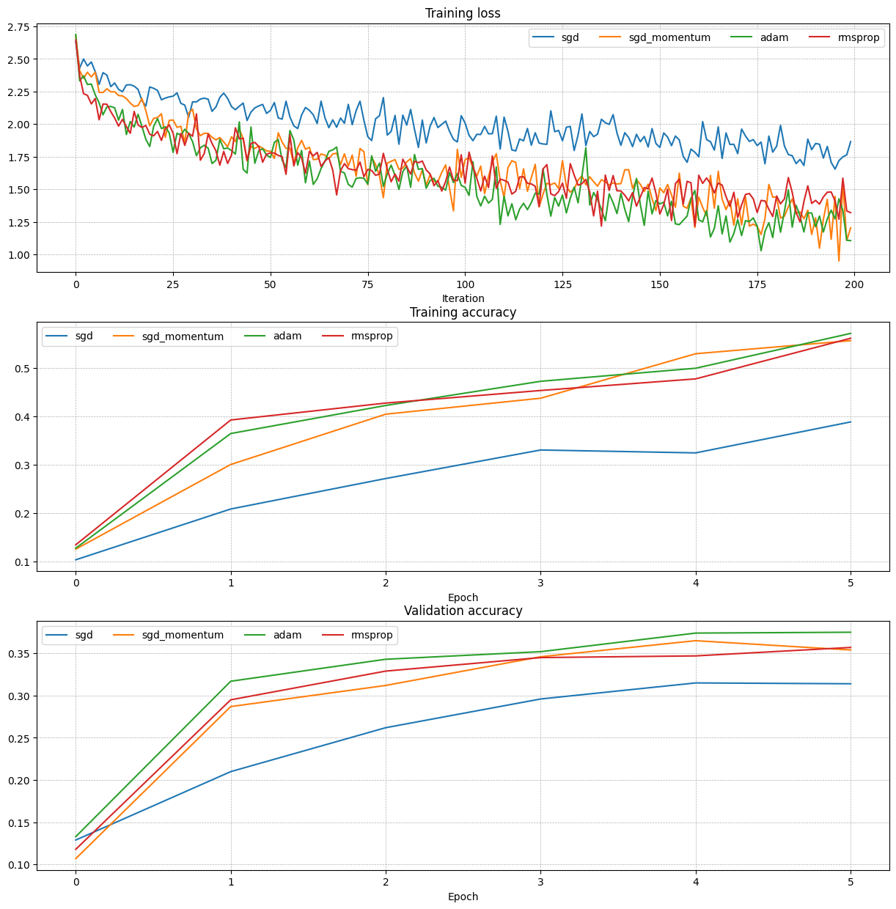


### Best Model 


# Assignment 02

## Q1: Batch Normalization


### Batch Normalization


Batch Normalization is defined as:
$$
\begin{split}
y_i & = \gamma \cdot \frac{x_i - \mu_B}{\sqrt{\sigma_B^2 + \epsilon}} + \beta \\
\quad \text{where }\sigma_B^2 &= \frac{1}{m} \sum_{i=1}^m (x_i - \mu_B)^2 \\ 
\mu_B &= \frac{1}{m} \sum_{i=1}^m x_i
\end{split}
$$


We also need store the `running_mean` and `running_var` to use the batch normalization during the testing stage:
$$
\begin{split}
\text{running\_mean}  &\leftarrow  (1 - \text{momentum}) \cdot \text{running\_mean}  + \text{momentum} \cdot \mu_B \\
\text{running\_var}  &\leftarrow  (1 - \text{momentum}) \cdot \text{running\_var} + \text{momentum} \cdot \sigma_B^2
\end{split}
$$


Backward pass of batch normalization
$$
\begin{split}
\frac{\partial L}{\partial \beta} &= \sum_{i=1}^N \mathrm{dout}_i \\[6pt]
\frac{\partial L}{\partial \gamma} &= \sum_{i=1}^N \mathrm{dout}_i \, \hat{x}_i \\[6pt]
\mathrm{d}\hat{x}_i &= \mathrm{dout}_i \, \gamma \\[6pt]
\frac{\partial L}{\partial \mathrm{var}} 
&= \sum_{i=1}^N \mathrm{d}\hat{x}_i \,(x_i - \mu)\,
\Big(-\tfrac{1}{2}\Big)(\mathrm{var} + \epsilon)^{-\tfrac{3}{2}} \\[6pt]
\frac{\partial L}{\partial \mu} 
&= \sum_{i=1}^N \mathrm{d}\hat{x}_i \, \Big(-(\mathrm{var}+\epsilon)^{-\tfrac{1}{2}}\Big) \\
&\quad + \frac{\partial L}{\partial \mathrm{var}} \cdot 
\sum_{i=1}^N \Big(-\tfrac{2}{N}(x_i - \mu)\Big) \\[6pt]
\frac{\partial L}{\partial x_i} 
&= \mathrm{d}\hat{x}_i \cdot (\mathrm{var}+\epsilon)^{-\tfrac{1}{2}} \\
&\quad + \frac{\partial L}{\partial \mathrm{var}} \cdot \frac{2}{N}(x_i - \mu) \\
&\quad + \frac{1}{N}\frac{\partial L}{\partial \mu}
\end{split}
$$


The alternative of the backward pass of the batch normalization:


$$
\begin{split}
\mathbf{dbeta} &= \sum_{i=1}^{N} \mathbf{dout}_i \\
\mathbf{dgamma} &= \sum_{i=1}^{N} \big(\mathbf{dout}_i \odot \hat{\mathbf{x}}i\big) \\
\mathbf{dx} &= \frac{\gamma}{\sqrt{\mathrm{var}+\epsilon}}\Bigg[
\mathbf{dout}
- \frac{1}{N}\sum{i=1}^{N}\mathbf{dout}_i
- \hat{\mathbf{x}} \frac{1}{N}\sum{i=1}^{N}\big(\mathbf{dout}_i \odot \hat{\mathbf{x}}_i\big)
\Bigg]
\end{split}
$$


### Batch Normalization for Deep Networks


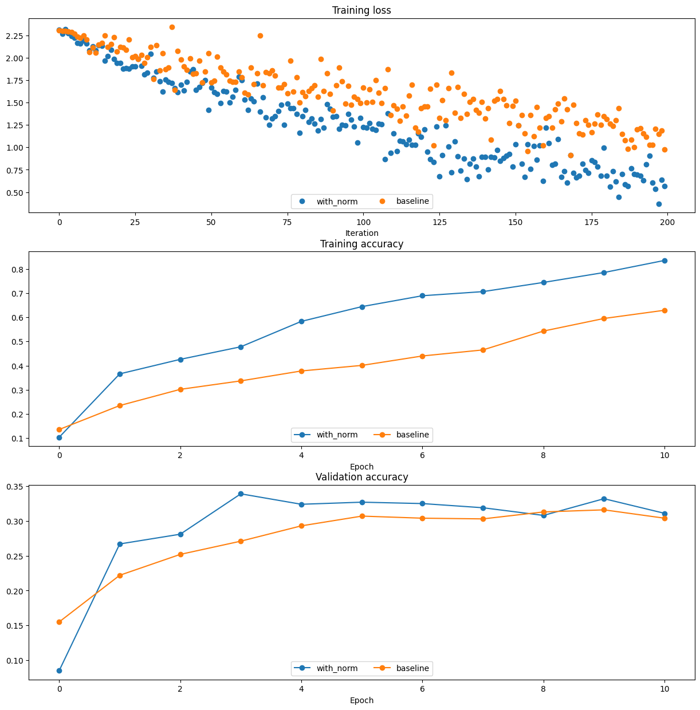

### Layer Normalization


$$
\begin{split}
\mu_i &= \frac{1}{D}\sum_{j=1}^{D} x_{ij} \\
\sigma_i^2 &= \frac{1}{D}\sum_{j=1}^{D} \big(x_{ij}-\mu_i\big)^2 \\
\hat{x}{ij} &= \frac{x{ij}-\mu_i}{\sqrt{\sigma_i^2+\epsilon}}\\
y_{ij} &= \gamma_j,\hat{x}_{ij} + \beta_j 
\end{split}
$$


## Q2: Dropout
Dropout 


## Q3: Convolutional Neural Networks


$$
\begin{aligned}
&\textbf{Inputs:}\\
&x \in \mathbb{R}^{N \times C \times H \times W}, \quad 
w \in \mathbb{R}^{F \times C \times HH \times WW}, \quad 
b \in \mathbb{R}^{F}, \quad \\
\text{stride} &= s,\ \ \text{pad} = p, \quad 
\\
&\textbf{After zero padding:} \\
x_{\text{pad}} &\in \mathbb{R}^{N \times C \times (H+2p) \times (W+2p)} \\

&\textbf{Output spatial dimensions:} \\
H’ &= 1 + \frac{H + 2p - HH}{s} \\
W’ &= 1 + \frac{W + 2p - WW}{s}
\\
&\textbf{Forward convolution:} \\
\text{for } n &= 1,\dots,N \\
\text{for } f &= 1,\dots,F \\
\text{for } i &= 0,\dots,H’-1 \\
\text{for } j &= 0,\dots,W’-1 \\
&\quad \text{define the receptive field:} \\
&\quad R_{n,i,j} = x_{\text{pad}}[n, :,\ i\cdot s : i\cdot s + HH,\ j\cdot s : j\cdot s + WW] \\
&\quad \text{then compute:}\\
&\quad out[n,f,i,j] = \sum_{c=1}^{C}\sum_{u=1}^{HH}\sum_{v=1}^{WW}
R_{n,i,j}[c,u,v] \cdot w[f,c,u,v] + b[f]
\end{aligned}
$$


Small Dataset overftiing 


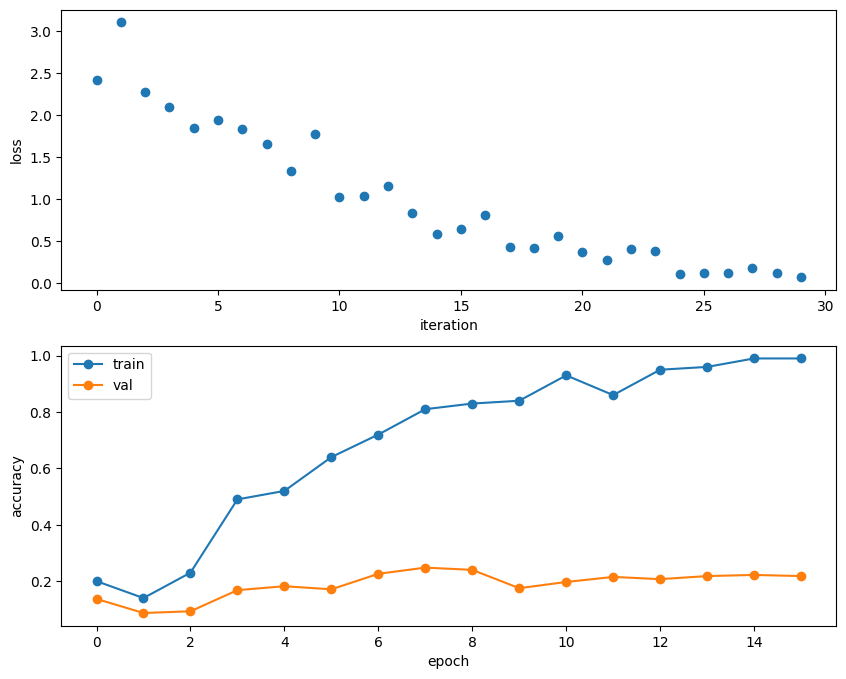

```Shell
Small data training accuracy: 0.81
Small data validation accuracy: 0.248
```


```Shell
Full data training accuracy: 0.46477551020408164
Full data validation accuracy: 0.485
```


## Q4: PyTorch on CIFAR-10

In this part, we will learn what is the PyTorch, finially, we can free out hands, and skip the boring Graidnet Calculation part!!


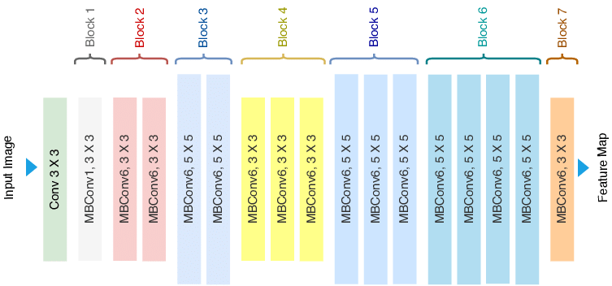


| Model Name      | Valid Accuracy % | Test Accuracy % |
| --------------- | ---------------- | --------------- |
| ResNet50        | 80.30            | 80.60           |
| Efficientnet_b0 | 80.00            | 79.42           |


## Q5: Image Captioning with Vanilla RNNs

Sampled Image

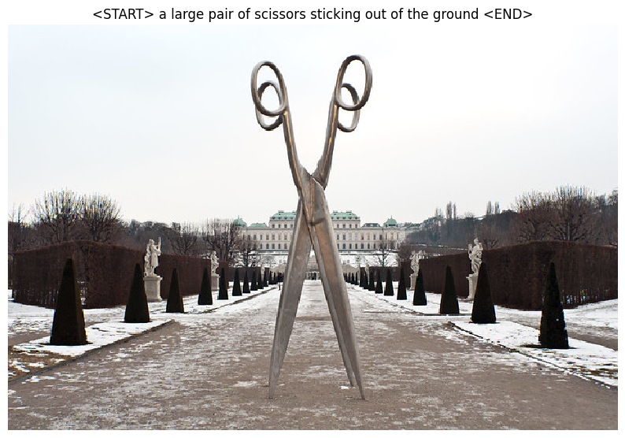


The Loss Curve of training RNN Image Caption

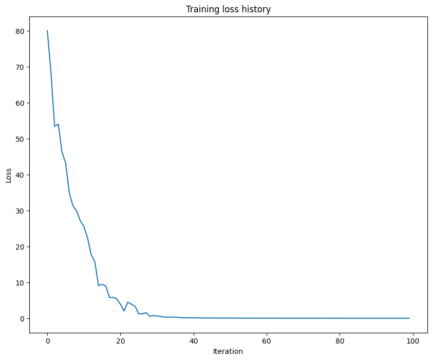

```Shell
Final loss:  0.013376469
```

The Example of the RNN-Image-Caption

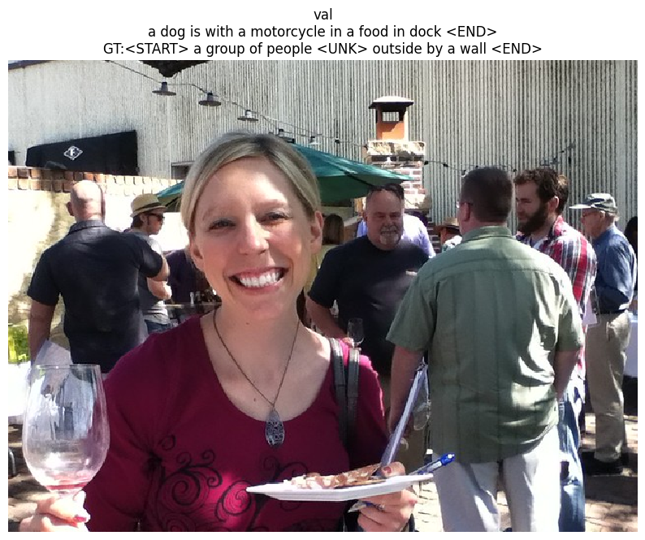


# Assignment 03

## Q1: Image Captioning with Transformers

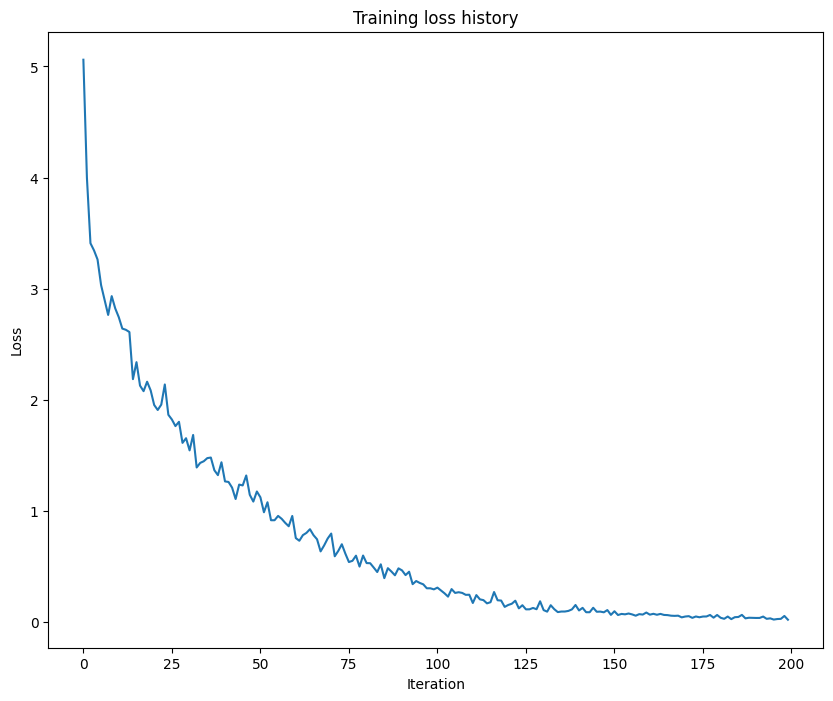


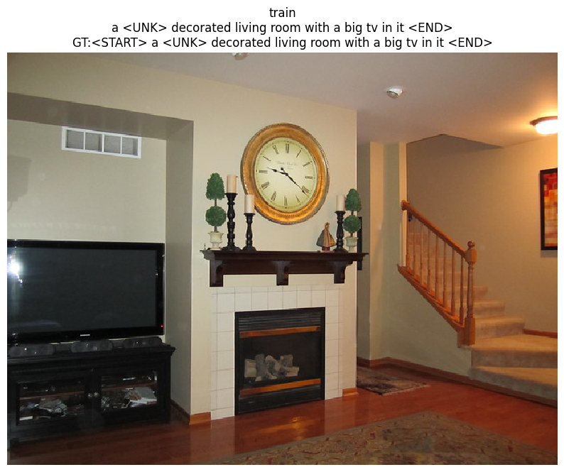


### Vision Transformer 

After we implemented the transformer, we just need implement the patch embedding, and use the encoder part of the transformer. 


>[!note] External Reference
> For those who want to learn more about Vision Transformer and Transformer, you can check my blog post [here](https://github.com/YYZhang2025/100-AI-Codes) where I explained the transformer and vision transformer in detail.


## Q2: Self-Supervised Learning for Image Classification


The loss function for 
$$
l \; (i, j) = -\log \frac{\exp (\;\text{sim}(z_i, z_j)\; / \;\tau) }{\sum_{k=1}^{2N} \mathbb{1}_{k \neq i} \exp (\;\text{sim} (z_i, z_k) \;/ \;\tau) }
$$


```Shell
# M

odel Params: 24.62M FLOPs: 1.31G
Train Epoch: [1/1] Loss: 3.2580: 100%|██████████| 390/390 [02:30<00:00,  2.59it/s]
Feature extracting: 100%|██████████| 782/782 [00:45<00:00, 17.03it/s]
Test Epoch: [1/1] Acc@1:83.62% Acc@5:99.36%: 100%|██████████| 157/157 [00:11<00:00, 14.00it/s]
```


Without SimCLR

```Shell
Train Epoch: [10/10] Loss: 2.4030 ACC@1: 12.96% ACC@5: 57.64%: 100%|██████████| 40/40 [00:08<00:00,  4.98it/s]
Test Epoch: [10/10] Loss: 2.4337 ACC@1: 15.30% ACC@5: 58.28%: 100%|██████████| 79/79 [00:11<00:00,  6.99it/s]

Best top-1 accuracy without self-supervised learning:  15.299999999999999
```


With Self-Supervised Learning 

```Shell
Train Epoch: [10/10] Loss: 0.6428 ACC@1: 79.24% ACC@5: 98.08%: 100%|██████████| 40/40 [00:08<00:00,  4.93it/s]
Test Epoch: [10/10] Loss: 0.5373 ACC@1: 82.63% ACC@5: 98.97%: 100%|██████████| 79/79 [00:10<00:00,  7.61it/s]

Best top-1 accuracy with self-supervised learning:  82.63000000000001

```


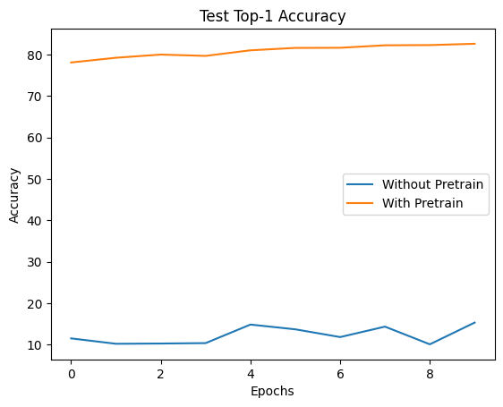


## Q3: Denoising Diffusion Probabilistic Models

Image Samples 


Forward Diffusion Pass 

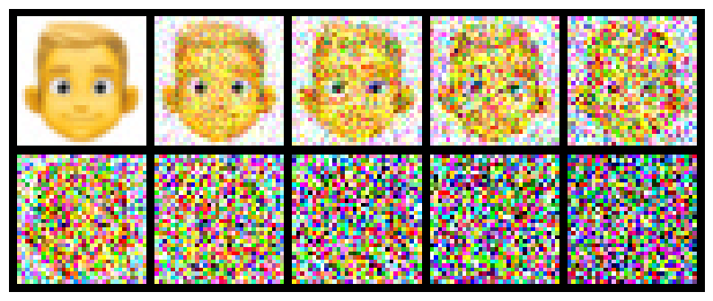


Reverse Pass 

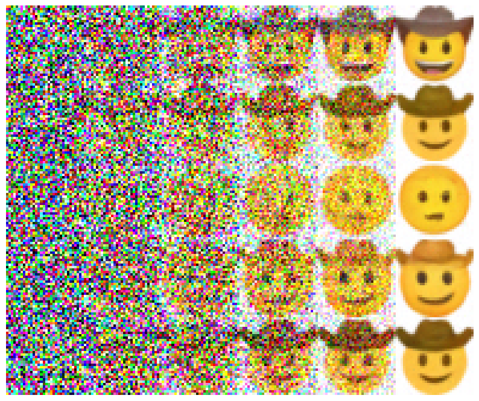


Conditioned DDPM

**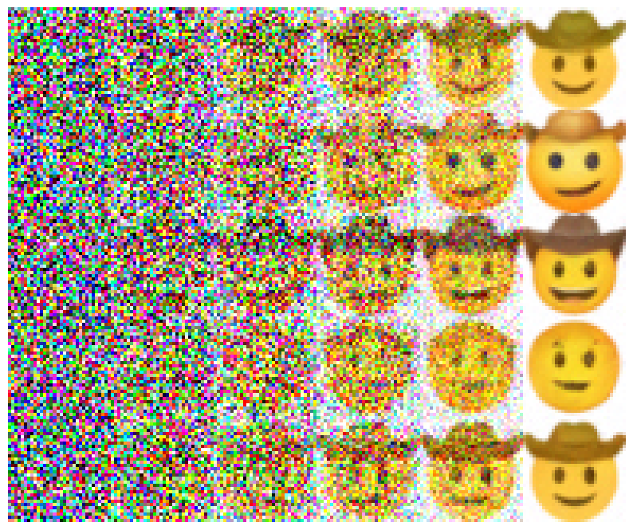**

## Q4: CLIP and DINO

### CLIP 


Dataset Sample 


Contrastive Sampels 

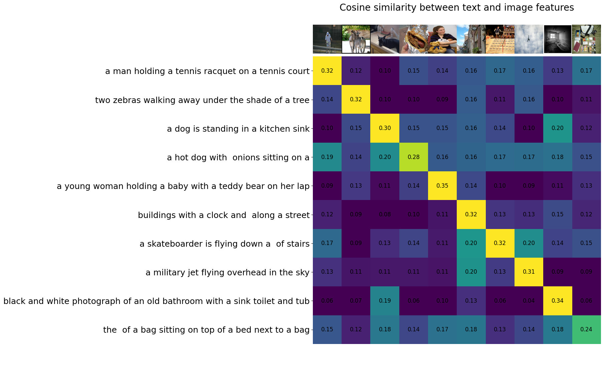

Zero-Shot Ability of CLIP model


### DINO 


DINO Attention Map

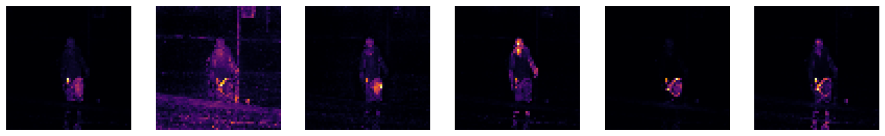


Patch Embedding visulization 

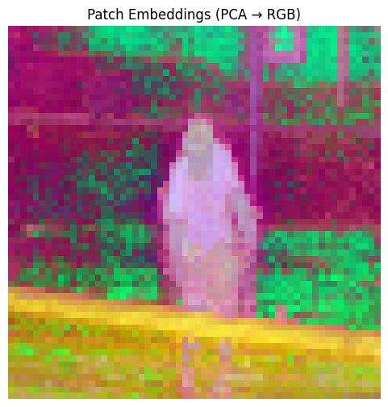


From Video  frame 

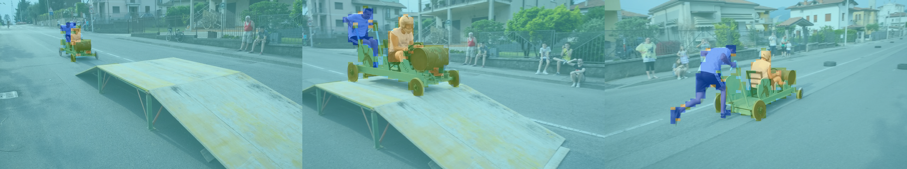


Video segementation 

<video src="./assets/dino_res.mp4"></video>


