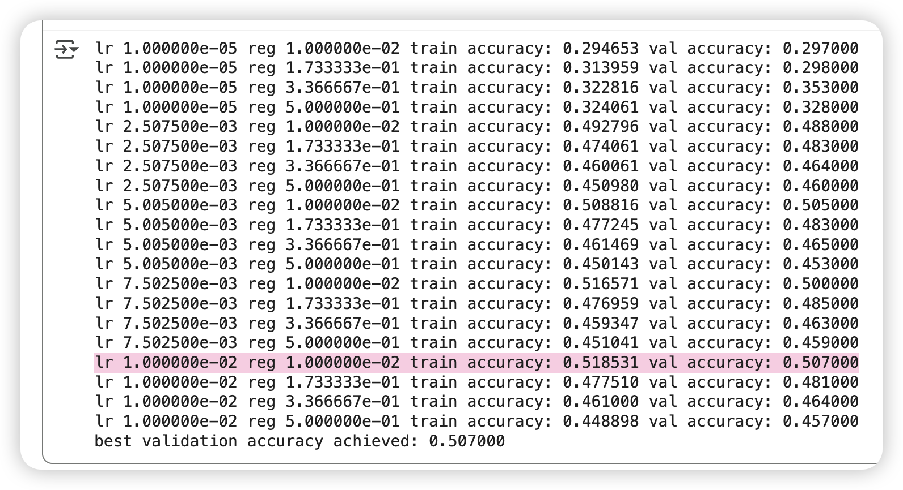

# Assignment 01

Change the folder name

```Python
FOLDERNAME = "Colab Notebooks/Stanford CS231N/assignment1/"
```

Install the dependent

```Python
!python -m pip install -U ipython ipykernel
```


## Q1: K-Nearest Neighbor classifier


### K-NN Algorithm
Assume we already have distance to each datapoint in the training set. The K-NN algorithm do the following, given `K` as arguments
1. sort training data points according to the distance 
2. get the most close `K` points 
3. count the most frequents class in those `K` points 
4. return the result

```Python
dist_to_x_test_i = dists[i]
# 1
sort_index = np.argsort(dist_to_x_test_i)
# 2
top_k_index = sort_index[:k]
closest_y = self.y_train[top_k_index]
# 3 / 4 
y_pred[i] = np.argmax(np.bincount(closest_y))
```


### Calculate Distance 

**L2 Distance** (Euclidean distance) is defined as:

$$
d_2(\mathbf{x}, \mathbf{y}) = \|\mathbf{x} - \mathbf{y}\|_{2}
= \sqrt{\sum_{i=1}^n |x_i - y_i|^2}
$$
```Python
dists[i, j] = np.sqrt(np.sum(np.power(x1 - x2, 2)))
```

while **L1 Distance** (Manhattan Distance) is defined as:

$$
d_1(\mathbf{x}, \mathbf{y}) = \|\mathbf{x} - \mathbf{y}\|_{1}
= \sum_{i=1}^n |x_i - y_i|
$$

Generally the **LP-Norm Distance** is 

$$
d_p(\mathbf{x}, \mathbf{y}) 
= \|\mathbf{x} - \mathbf{y}\|_{p}
= \left( \sum_{i=1}^n |x_i - y_i|^p \right)^{\tfrac{1}{p}}
$$
So the $L_{\infty}$ Norm is 
$$
d_\infty(\mathbf{x}, \mathbf{y}) = \max_{1 \leq i \leq n} |x_i - y_i|
$$

The result


Vector 

$$
d(\mathbf{x}_i, \mathbf{x}_j^{\text{train}})^2 = \|\mathbf{x}_i\|^2 + \|\mathbf{x}_j^{\text{train}}\|^2 - 2 \mathbf{x}_i \cdot \mathbf{x}_j^{\text{train}}
$$

```Python
dists = np.sqrt(
	-2 * (X @ self.X_train.T)
	+ np.power(X, 2).sum(axis=1, keepdims=True)
	+ np.power(self.X_train, 2).sum(axis=1, keepdims=True).T
) 
```


### Compares

```Shell
Two loop version took 280.040472 seconds
One loop version took 52.285528 seconds
No loop version took 1.028926 seconds
```

### Experiement & Cross Validation


## Q2: Implement a Softmax classifier


### Setup  
We have: data point $\mathbf{x}_i \in \mathbb{R}^{1 \times D}$, weights $W \in \mathbb{R}^{D \times C}$, logits  $\mathbf{s}_i = \mathbf{x}_i W \in \mathbb{R}^{1 \times C}$

- Predicted probabilities (softmax):  
  
$$
\hat{p}_{i,j} = \frac{e^{s_{i,j}}}{\sum_{k=1}^C e^{s_{i,k}}}, \quad j=1,\dots,C
$$
- One-hot label:  

$$
y_i \in \mathbb{R}^{1 \times C}, \quad y_{i,k} = 1 \text{ for the true class } k
$$

The **cross entropy loss** $\mathcal{L}$ is defined as 

$$
\mathcal{L}_i = -\sum_{j=1}^C y_{i,j} \log \hat{p}_{i,j}
= -\log \hat{p}_{i,k}
$$

To calculate the gradient of $W$ w.r.t. $\mathrm{x}_{i}$, we can implement the **chain rule**

$$
\frac{\partial \mathcal{L}_i}{\partial W}
= \frac{\partial \mathcal{L}_i}{\partial \hat{p}_i} \cdot
\frac{\partial \hat{p}_i}{\partial \mathbf{s}_i} \cdot
\frac{\partial \mathbf{s}_i}{\partial W}
$$

For each components:

$$
\frac{\partial \mathcal{L}_i}{\partial \hat{p}_{i,j}} = -\frac{y_{i,j}}{\hat{p}_{i,j}}
$$

Softmax Jacobian:  

$$
\frac{\partial \hat{p}_{i,m}}{\partial s_{i,j}} 
= \hat{p}_{i,m}\big(\delta_{m,j} - \hat{p}_{i,j}\big)
,
\quad 
\text{where }
\delta_{m,j} = 
\begin{cases}
1 & m=j \\
0 & m\neq j
\end{cases}
$$

So the gradient w.r.t. logits($s_{i}$) is simply:  

$$
\frac{\partial \mathcal{L}_i}{\partial s_{i,j}}
= \sum_{m=1}^C \frac{\partial \mathcal{L}_i}{\partial \hat{p}_{i,m}} 
\frac{\partial \hat{p}_{i,m}}{\partial s_{i,j}}
= \hat{p}_{i,j} - y_{i,j}
\implies \nabla_{s_i}\mathcal{L}_i = \hat{p}_i - y_i
$$

For the linear function: 

$$
\frac{\partial s_{i,j}}{\partial W_{d,j}} = x_{i,d}
$$

Put all together, we have:  

$$
\nabla_W \mathcal{L}_i = \mathbf{x}_i^\top (\hat{p}_i - y_i)
$$

In sum: 
- For a single data point $\mathbf{x}_i$, the **outer product** between $\mathrm{x}_{i}$ and $(\hat{p}_i - y_i)$

$$
\nabla_W \mathcal{L}_i = \mathbf{x}_i^\top \, (\hat{p}_i - y_i)
$$

- For the entire dataset $X \in \mathbb{R}^{N \times D}$:  

$$
\nabla_W \mathcal{L} = X^\top (\hat{P} - Y)
$$  

The Loss Curve:


Cross-validation


  

## Q3: Two-Layer Neural Network


### Affine Layer

Forward, according to the assignment, we need to reshape the $x$
$$
\text{out} = xW + b
$$

Backward

$$
\frac{\partial L}{\partial x} = d\text{out} \, W^\top
$$

Remember to reshape the $x$ back to the original shape 

$$
\frac{\partial L}{\partial W} = x^\top \, \text{dout}
$$

$$
\frac{\partial L}{\partial b} = \sum_{i=1}^N \text{dout}_{i,:}
$$

### ReLU


$$
\text{out} = \text{ReLU}(x) = \max(0, x)
$$

$$
dx = \text{dout} \odot \mathbf{1}_{\{x > 0\}}
$$


### Experiement


### Cross Validation


## Q4: Higher Level Representations: Image Features
Just run the code and observe the features. 
For softmax classifier



For Two Layer Network


## Q5: Training a fully connected network


Three-layer Net to overfit 50 training examples


Five-layer Net to overfit 50 training examples


### SGD vs. SGD Momentum


### RMSProp and Adam


### Best Model 


# Assignment 02

## Q1: Batch Normalization

## Q2: Dropout

## Q3: Convolutional Neural Networks

## Q4: PyTorch on CIFAR-10

## Q5: Image Captioning with Vanilla RNNs


# Assignment 03

## Q1: Image Captioning with Transformers

## Q2: Self-Supervised Learning for Image Classification

## Q3: Denoising Diffusion Probabilistic Models

## Q4: CLIP and Dino